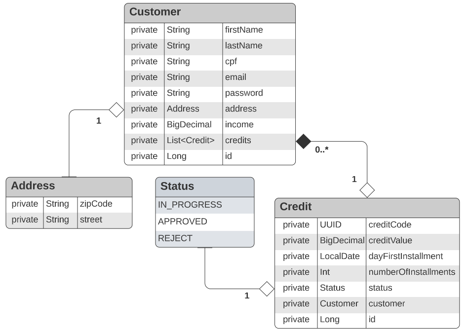

# Sistema de Crédito

<p>Uma API de sistema de crédito desenvolvido com <a href="https://kotlinlang.org/">Kotlin</a> e <a href="https://spring.io/projects/spring-boot">Spring Boot</a></p>
<p>O objetivo deste projeto era desenvolver uma API REST que executasse as funcões de um CRUD (Create, Read, Update, Delete).</p>

## Tecnologias Utilizadas

- [Kotlin](https://kotlinlang.org/)
- [SpringBoot](https://spring.io/projects/spring-boot)
- [Gradle](https://gradle.org/)

## Pré-requisitos

- JDK 8 ou superior
- Gradle

# Como executar o projeto

```bash
# Clonando o repositório
git clone https://github.com/matheustanaka/credit-app

# Entrando no diretório
cd credit-app

# OBS: Recomendo Utilizar a IDE Intellij para executar o projeto.
# Inicializando o build do projeto
./gradlew build

# Executando o projeto
./gradlew bootRun

# Rota do projeto
http://localhost:8080

# Rota para testar a API
http://localhost:8080/swagger-ui/index.html
```

# Diagrama da API

</img>

# Rede sociais

- [Linkedin](https://www.linkedin.com/in/matheus-tanaka-42a833186/)
- [Twitter](https://twitter.com/matheus__tanaka)
- [Email](matheustanakanog@gmail.com)
